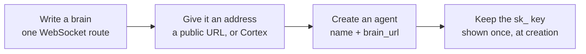
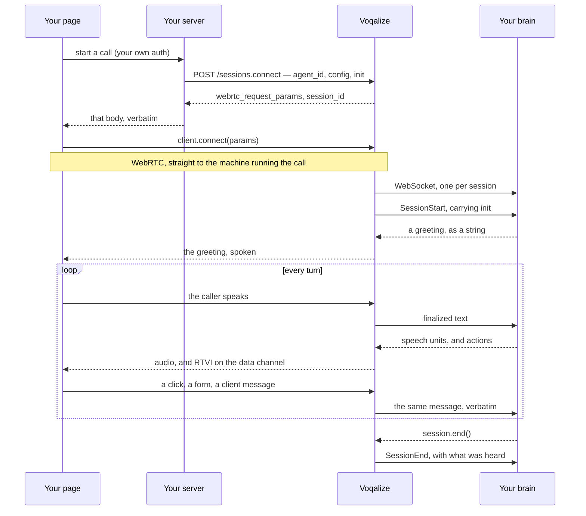

A Voqalize call touches four things you own: a WebSocket route, an agent record,
one HTTP request from your server, and a page running
[pipecat](/start/pipecat/). Everything else — the audio, the recognizer, the
voice, the turn-taking — happens between them.

This page is that path in order. It is the map; each step names the page that
goes deeper.

## What you build once



### 1. A brain is a WebSocket route

Voqalize dials one URL, once per session:

```
{brain_url}?session_id={session_id}
```

The connection opens when the call starts and closes when it ends. Frames are
protobuf and the contract is published — [the wire](/reference/wire/) is
406 lines of it. In Python that route is a `Brain` subclass and a call to
`run_session`; the [FastAPI example](https://github.com/voqalize/voqalize/tree/main/sdk/python/examples/fastapi_inbound)
is a working one in about sixty lines.

Your route needs to be reachable from us. When it cannot be — a laptop, a VPC
with no ingress, a serverless function — [Cortex](/deploy/cortex/) has your
brain dial out instead, and the brain code is unchanged.

### 2. Behind the socket, whatever you already run

The brain receives finalized text and returns the words to speak. What produces
those words is yours: a model call, an agent framework, a state machine, a
lookup table. `GeminiBrain` ships in the SDK for the case where you want a model
loop already wired, and the eleven demo brains are readable source.

Your model, your prompts, your tools and your retrieval stay in the process you
deploy today.

### 3. Drive it before there is a call to make

The conformance harness opens a real socket, speaks real protobuf, and drives
your brain through the scenarios the runtime produces — barge-in, idle, an
abandoned turn — with no microphone and no account. This is the loop to be in
while you are writing the brain; steps 4 onward are for when it answers
correctly. See [testing a brain](/brain/testing/).

### 4. Create the agent

Two fields matter:

```
create_agent(tenant, name, brain_url="https://…/voice")
  → { agent, session_key }   # sk_… , shown once
```

Over [the MCP server](/reference/mcp/) from your editor, or the console.
Keep the `agent_id` and the `sk_` key: [every credential names one
agent](/operate/keys/), and the raw key is stored only as a hash.

**The agent record says where the brain lives.** It carries no voice, no
language, no recognizer settings — those depend on *this* caller, and an agent
record cannot. Our own lead-qualification brain is the proof: it reads a state
from the enquiry form and answers a caller in Tamil Nadu in Tamil, which is a
fact that does not exist until the call starts. So the record holds `brain_url`,
and step 6 holds the rest. The one default it does carry is whether calls for
this agent are [recorded](/operate/recordings/).

## What happens on every call



### 5. Your page asks your server

The browser asks your backend for a call. How that request is authenticated is
entirely yours — a session cookie, a bearer token, whatever your app already
does. We never see it.

There is a second path where a publishable `pk_` key sits in the page and the
browser calls us directly, which suits a demo or a marketing page.
[The handshake](/client/handshake/) covers both; the rest of this page
follows the server path, because it is the one where you get to decide who may
start a call.

### 6. Your server starts the session

One request, holding two named things:

```http
POST https://api.voqalize.com/api/v1/sessions.connect
Authorization: Bearer sk_live_…
Content-Type: application/json

{
  "agent_id": "agt_…",
  "config": {
    "tts": { "voice": "VOICE_OMNIVOICE_GAURI", "language": "LANGUAGE_TA" },
    "stt": { "language": "LANGUAGE_TA" },
    "idle": { "timeout_ms": 8000 },
    "record": false
  },
  "init": { "order_id": "A-1183", "tier": "gold" }
}
```

**`config` is how this call sounds and listens.** It is the same `Config` the
brain sends mid-call, parsed as proto3 JSON — enum members are their names, and
a name we do not serve is refused at mint with the field pointed at. Send only
what you want moved; both legs of a language change travel together, because
moving one leaves the call listening in a language it is answering out of. See
[the catalog](/reference/catalog/) for what is on the roster and
[why there is no provider slot](/reference/no-provider-slot/) for the
question underneath it.

`record` rides beside the three sections and stays out of the wire `Config`,
because its lifetime is different: `tts`, `stt` and `idle` move any time, and
recording is decided once, here. A `pk_` key may turn it off and may not turn it
on — [recordings](/operate/recordings/) says why.

**`init` is what your brain gets and nobody else reads.** It arrives at
`session.init` under that exact name, uninterpreted by everything in between:
the account this caller is signed into, the order they are asking about, the
plan they are on. It is stored on the session record, so send identifiers rather
than personal data.

Both are optional. A request with an `agent_id` and nothing else starts a call in
English on both legs.

### 7. Your server hands the body back

The answer is what a pipecat transport connects with:

```json
{
  "webrtc_request_params": {
    "endpoint": "https://…/webrtc",
    "headers": { "Authorization": "Bearer <session token>" }
  },
  "session_id": "…"
}
```

Return it to the browser unchanged and hand it to `connect`. A pipecat page
forwards this body rather than reading it — `startBotAndConnect` is literally
`connect(await startBot(params))` — which is why the response is these two keys
and no session record.

Two things to know before the first call: the `endpoint` is **one machine**,
chosen when the session is minted, so it cannot be a constant in your page; and
`headers` has to be a real `Headers` object today, one line in your page, for a
reason [the handshake](/client/handshake/) writes down.

The media is direct UDP from the browser to that machine. Nothing of ours
proxies the audio.

### 8. The greeting

Voqalize builds the pipeline, dials your brain, and sends `SessionStart` with
`init` on it. Your brain returns a greeting.

The caller is connected and hearing silence while that call returns, which is
why a greeting is a **string** — a fixed line, or a template over what `init`
carried. A model call here is a second and a half of nothing, at the one moment
a caller has no idea whether the call is working.

`on_session_start` runs alongside it, and it is where a brain sets the voice and
language for this caller with `session.configure(...)`.

### 9. The turn loop

The caller speaks. Voqalize decides when they have finished and hands your brain
the finalized text.

Your brain yields speech in **units**. Speaking starts on the first unit, so the
reply begins before it has finished being generated, and each unit is one thing
the caller can be interrupted out of. When they do interrupt, the audio stops and
the in-flight turn is cancelled.

At the end of each unit your brain is told what the caller actually **heard**.
A reply that generated three sentences and was cut after one is remembered as
one — that reconciliation is the brain's job, and the SDK keeps no history for
you. [Interruption and heard truth](/design/interruption-and-heard-truth/)
is the long version.

### 10. Both directions on the data channel

The same RTVI data channel carries the transcript, so both of these land while
audio is still flowing.

**Brain to page:** `session.dispatch(SomeAction(...))` sends a typed message your
page receives as an event — a form to open, a row to highlight, a total to
update. A number the caller has to hold in their head is a number that belongs
on the screen.

**Page to brain:** pipecat's own client methods send back what the caller
clicked or typed, and it arrives at `on_rtvi` while the floor stays where it
was. That callback cannot speak, so an agent cannot talk over the person who
just clicked.

Ten message types cross, five each way. [The RTVI plane](/reference/rtvi/)
is the list, and says which of them are pipecat's rather than ours.

### 11. The call ends

Either side ends it: `session.end()` from the brain, or the caller hangs up.
`on_session_end` is where you write your own record of what happened.

Ours is readable back through the MCP server or the API — the
[session log](/operate/logs/) with its wire frames, the
[recording](/operate/recordings/) if you asked for one, and
[usage](/operate/usage/).

## Where each setting comes from

Three levels, and the later one wins:

1. **Voqalize's defaults** — English on both legs.
2. **Your server's `config`**, at connect. What this caller gets, decided by
   code that knows who they are.
3. **The brain**, with `session.configure(Config(...))` — at session start, or
   any time during the call.

The brain always has the last word, because `on_session_start` runs after connect.
Levels 2 and 3 are the same message seen from two sides: your server sets the
call up knowing who booked it, and the brain moves it knowing how the
conversation is going.

## The optional half

None of this is needed for a first call, and each has a page:

- [**Cortex**](/deploy/cortex/) — your brain dials out, when it cannot
  accept inbound connections.
- [**Recording**](/operate/recordings/) — per agent as a default, per
  session as a decision.
- [**The avatar**](/client/avatar/) — a talking head in the page, driven by
  the same session. The processor is already in every pipeline, so this is a
  browser-side change.
- [**Idle detection**](/reference/wire/) — `idle.timeout_ms` hands the brain
  the floor after silence, and `0` turns it off.
- [**Voice and language**](/reference/catalog/) — two personas, English and
  22 Indic languages.
- [**The MCP server**](/reference/mcp/) — agents, keys and sessions from
  inside your editor.

## Read next

- [Connections and the handshake](/client/handshake/) — steps 5 to 7, in full, both credential paths.
- [Testing a brain](/brain/testing/) — step 3, which is where the day is actually spent.
- [The wire](/reference/wire/) — the contract both ends are held to.
- [Designing for voice](/design/the-turn-budget/) — what changes once it works.
